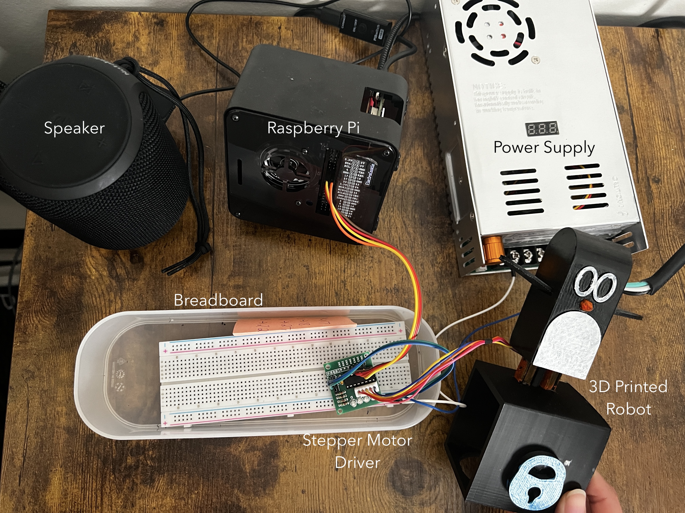
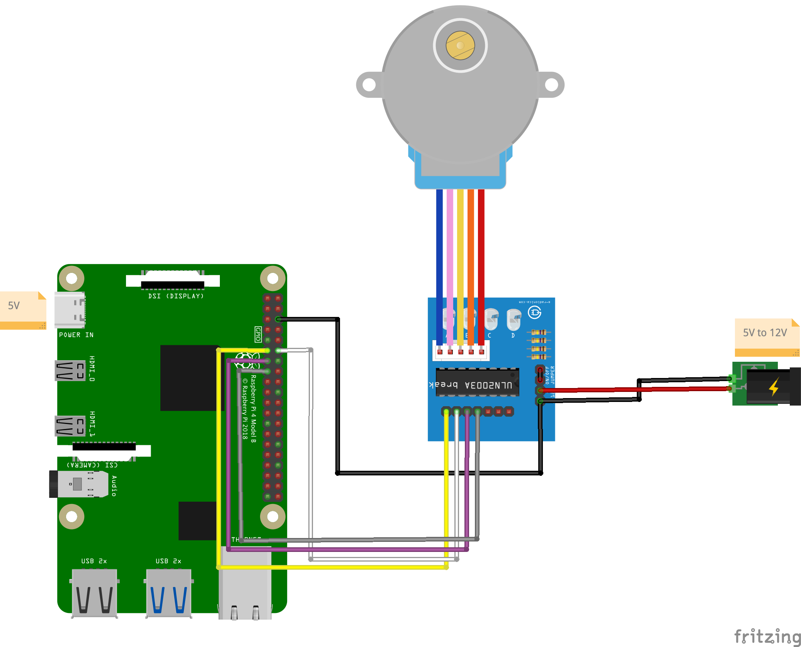

# OnlyFans-Notification-Robot
I created the world's first ever OnlyFans notification ROBOT!

## Description
This is an OnlyFans notification robot developed using a Python script running on a Raspberry Pi to monitor an email account for new subscriber notifications from OnlyFans. Upon receiving a new subscriber email, the script activates a stepper motor connected to the Raspberry Pi, which in turn triggers a 3D printed penguin to move and makes a pygame module play a sound. The crucial Python libraries used here are the RPi.GPIO for controlling the Pi's GPIO pins, imaplib to interface with the email servers, and pygame to handle audio playback. Its a creative and enjoyable way to get notified about your increasing fan base on OnlyFans.


## Project parts
- Raspberry Pi
- Stepper motor
- Stepper motor driver
- 3D printed robot
- Power supply
- Speaker
- Breadboard and jumper wires
- Python script


## GPIO Setup

The GPIO setup involves the following sequence of pins: 17, 18, 27, 22. For a full breakdown of the exact connection sequence, refer to the image below.



## How It Works

The Python script continuously checks the specified email for new mail from OnlyFans. If a new message is detected, the motor is activated, causing the penguin to "dance" and an audio file to play.

## Demo

I have a full demo video on my YouTube channel explaining the entire process of the project.
[Demo Video Link](https://youtu.be/RxCx31hxskU)

## Code 

The Python code to power the device is included below:

```python
import RPi.GPIO as GPIO
import time
import imaplib
import email
import pygame  # import pygame library

# define the pins that will connect to the stepper motor driver
# GPIO pins
pin_seq = [17, 18, 27, 22]

# Setup GPIO
GPIO.setmode(GPIO.BCM)
for pin in pin_seq:
    GPIO.setup(pin, GPIO.OUT)
    GPIO.output(pin, False)

# Motor sequence
step_seq = [
    [1, 0, 0, 1],
    [1, 0, 0, 0],
    [1, 1, 0, 0],
    [0, 1, 0, 0],
    [0, 1, 1, 0],
    [0, 0, 1, 0],
    [0, 0, 1, 1],
    [0, 0, 0, 1],
]

# Function to perform one step
def step(index):
    for pin, value in zip(pin_seq, step_seq[index]):
        GPIO.output(pin, value)

# Gmail IMAP server details
USERNAME = 'my-email@gmail.com' #replace with your email
APP_PASSWORD = '000000' # replace with your app password
MAIL_SERVER = 'imap.gmail.com'
SENDER_EMAIL = 'no-reply@email.com' #replace with the email account you want to receive a notification from

# Initialize pygame mixer
pygame.mixer.init()

# Load the sound file
sound = pygame.mixer.Sound("sound.wav") #replace with the name of the audio file you want to play

def check_email(user, app_pwd, mail_server, sender):
    # connect to the server and go to its inbox
    mail = imaplib.IMAP4_SSL(mail_server)
    mail.login(user, app_pwd)
    mail.select('inbox')

    # search for the mail from the given sender and mark as unseen
    result, data = mail.uid('search', None, '(FROM "{}" UNSEEN)'.format(sender))
    mail_ids = data[0]

    # if new mail, perform the stepper motor action
    if mail_ids:
        email_ids = mail_ids.split()
        latest_email_id = email_ids[-1]
        # mark the latest email as seen
        mail.uid('store', latest_email_id, '+FLAGS', '(\Seen)')
        # Play the sound
        sound.play()
        # Rotate motor 512 steps
        for _ in range(512*4):
            for i in range(len(step_seq)):
                step(i)
                time.sleep(0.0007)  # Motor moves faster

while True:
    check_email(USERNAME, APP_PASSWORD, MAIL_SERVER, SENDER_EMAIL)
    time.sleep(20) # check every 20 seconds

# Cleanup
GPIO.cleanup()
```

Remember to replace the placeholders for email and password with your personal details. 

Happy creating!
